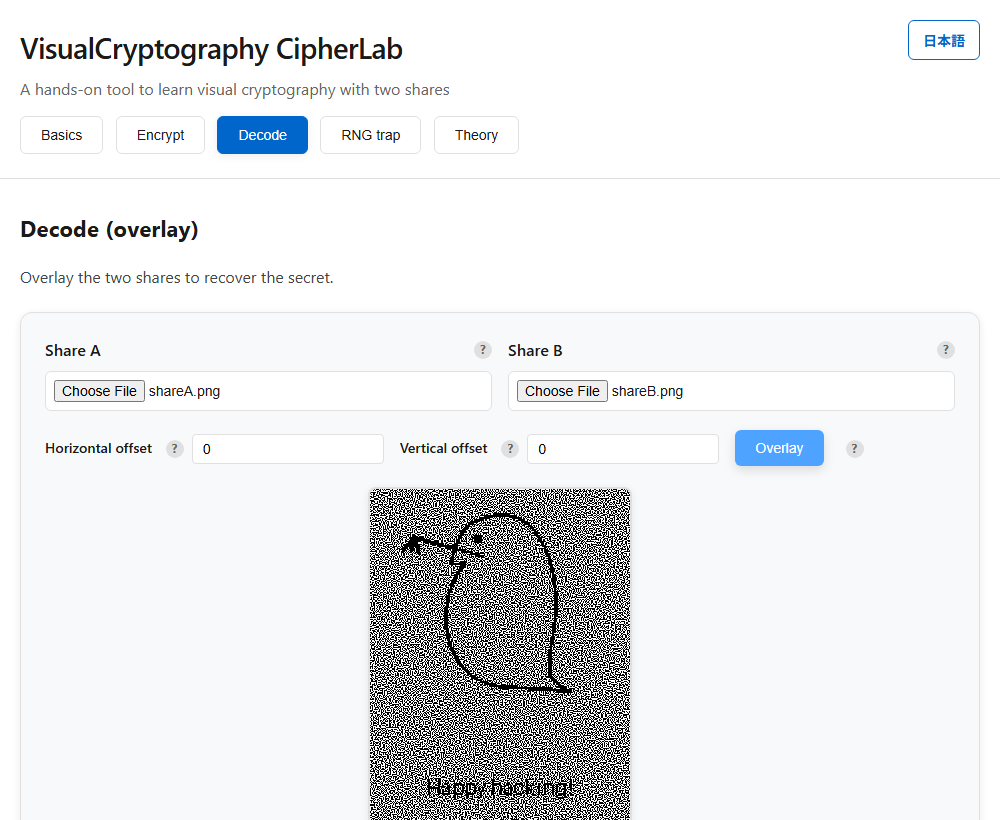
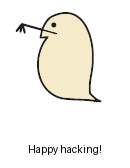
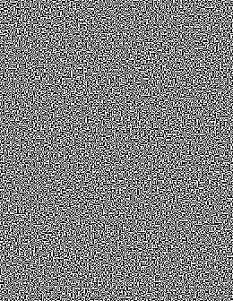
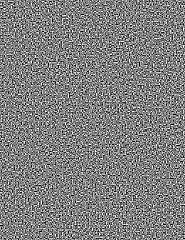
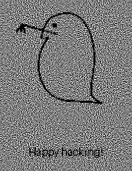
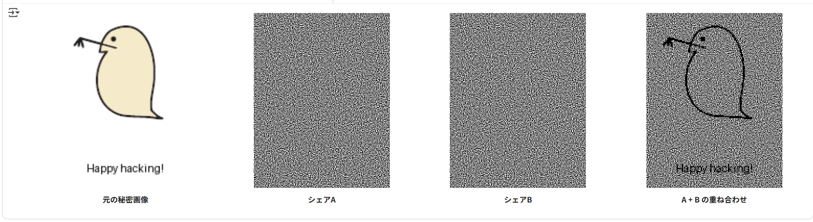

# VisualCryptography CipherLab - Visual Cryptography Training Tool


[](https://ipusiron.github.io/visual-cryptography-cipherlab/)


**Day070 - 100 Security Tools with Generative AI**

English · [日本語](README.md)

**VisualCryptography CipherLab** is a web tool for experiencing the basics of visual cryptography.

It splits an image into two shares. Each share means nothing on its own, but overlaying them makes the secret image appear.

>Visual cryptography supports multiple shares, but this tool keeps it simple with just two shares.

---

## 🌐 Demo

👉 **[https://ipusiron.github.io/visual-cryptography-cipherlab/](https://ipusiron.github.io/visual-cryptography-cipherlab/)**

Try it directly in your browser.

---

## 📸 Screenshot

>  
>*Overlaying two shares reveals the original image to the eye*

---

## ✨ Features

- **Five tabs**
  - **Basics** — the basic concepts and properties of visual cryptography
  - **Encrypt** — split an image into two random shares
  - **Decode** — overlay two shares to recover the secret
  - **RNG trap** — experience how a predictable RNG lets one share alone recover the secret
  - **Theory** — advanced theory and applications in accordions

- **Intuitive UI**
  - A clean light-mode design
  - Help icons (?) show details on hover, tap and keyboard
  - Responsive for various devices
  - Japanese / English switch (button at the top right; also `?lang=ja` / `?lang=en`)

- **Image processing**
  - Drag & drop image files
  - Threshold adjustment for black/white conversion
  - Share generation with 2×2 pixel expansion (patterns chosen with `crypto.getRandomValues`)
  - Individual download of generated shares

- **Decoding**
  - Overlay display of two share images
  - Offset for alignment (horizontal / vertical)
  - Fast composition with the Canvas API

- **Educational content**
  - The basic principle of visual cryptography, with figures
  - The theory behind VSSS (Visual Secret Sharing Scheme)
  - Practical applications (authentication, anti-counterfeiting, QR codes, etc.)
  - Sample images and a Python generator script

---

## 🔐 What is visual cryptography?

**Visual cryptography** was proposed in 1994 by **Moni Naor** and **Adi Shamir**.

Ordinary cryptography follows "ciphertext + key → decryption algorithm → plaintext", but in visual cryptography **decoding needs no computation; the human eye itself is the decoder**.

- The secret image is split into several shares (transparent films or image files).
- A single share looks like completely random noise and reveals nothing.
- Overlaying the required number of shares makes the secret appear through the difference in black/white density.

### Illustration

Visual cryptography splits the original into **two shares**. Each looks like random noise, but overlaying them reveals the secret.

| Original | Share A | Share B | Overlay (decoded) |
|--------|--------|--------|-------------------------|
|  |  |  |  |

These images were made with [generate_vss_sample.py](examples/generate_vss_sample.py).

- **secret.png** - the original secret image
- **shareA.png** - share A (a random dot pattern)
- **shareB.png** - share B (a random dot pattern)
- **overlay.png** - the result of overlaying shares A and B (the secret is recovered)

### Generating the sample images

To run `generate_vss_sample.ipynb` on Google Colab:

1. Click the "Open in Colab" button below.

[](https://colab.research.google.com/github/ipusiron/visual-cryptography-cipherlab/blob/main/examples/generate_vss_sample.ipynb)

No setup needed — it runs in the browser.

2. When Colab opens, run the cells in order.
3. The four generated images are shown.

>  
>*Comparison of the four generated images*

---

## 🔍 A simple example: the basic principle

Consider recording a black-and-white binary image on two sheets (shares).

- **Black pixel**
  - Sheet A: ■□
  - Sheet B: □■

- **White pixel**
  - Sheet A: ■□
  - Sheet B: ■□

### A single sheet
- Each sheet looks like meaningless static with half "■" and half "□".
- From one sheet alone you cannot tell whether the original pixel was black or white.

### Overlaying the two
- **Black pixel**
  - Overlaying (■□ and □■) → "■■", looks black.
- **White pixel**
  - Overlaying (■□ and ■□) → "■□", looks grayish.

### Result
- Black looks black and white looks gray, so the contrast lets the human eye read the secret image.

👉 This simple "black = looks dark, white = looks gray" mechanism is the basic principle of visual cryptography. (This tool uses a 2×2 expansion; see the Theory tab.)

---

## 📋 Properties of visual cryptography

- **Decoded by the human eye**
  No PC or algorithm. Just overlay the shares to recover the secret.
- **A single share carries no information**
  An unpredictable RNG (`crypto.getRandomValues`) chooses the pattern, so one share does not tell whether the pixel was white or black (a predictable RNG would let one share recover it).
- **Pixel expansion**
  Each pixel is replaced by several subpixels, so the shares grow larger.
- **For black-and-white images**
  Basically binary images. Grayscale and color need extended schemes.

---

## 🗺️ Example use: a map image

Ways of using this tool in particular

- Confirming that a picture appears from the difference in darkness (image and contrast classes): each original pixel spreads into a 2x2 block of 4 cells. For a white pixel the two shares use the same pattern, so overlaying them leaves 2 of the 4 cells black (half black). For a black pixel the two shares are inverted patterns, so overlaying them makes all 4 cells black. You can confirm that the overlaid picture appears from the darkness gap, white being half black and black being all black
- Confirming that a single share leaks nothing (secret-sharing and perfect-secrecy classes): share A is the same one, chosen from 6 patterns, whether the original pixel is white or black. So seeing share A alone does not decide whether the pixel is white or black. You can confirm the perfect-secrecy property that one of the two shares alone leaks no information about the original picture
- Confirming that you can recover only with both shares (2-of-2 secret sharing classes): the original pixel appears as a darkness gap only when you overlay the two shares (an OR per cell). Recovering the original black and white from share B needs to know which pattern was used (the arrangement on the share-A side). You can confirm the 2-of-2 secret-sharing mechanism where recovery fails if either of the two is missing

You can also use this tool to "hide / share the location of a mark". For example, make two shares from a treasure map; overlaying them reveals the treasure location.

Here we use `examples/map.png` (a map with a mark at Soma City) to generate and recover shares and confirm the marked location.

### Steps

1. In the **Encrypt tab**, upload `examples/map.png`.
2. Save the generated **shareA.png** and **shareB.png**.
   - Each looks like noise, so one alone does not reveal the mark.
3. In the **Decode tab**, load shareA / shareB and overlay them.
4. The recovered image lets you locate the mark at Soma City.

---

## 🚀 Toward VSSS (Visual Secret Sharing Scheme)

- **(2,2) scheme → (k,n) scheme**
  Generalized from "recover with 2 shares" to "recover with any k of n shares".
- **Blending with secret sharing**
  Like secret sharing in cryptography, several people must bring their shares together to recover.
- **Extended schemes**
  Research has advanced on grayscale/color support and efficient non-expanding schemes.

---

## 💡 Applications of VSSS

- **Authentication and access control**
  Usable for two-factor authentication or entry checks; overlaying the shares reveals an auth mark.
- **Anti-counterfeiting and watermarks**
  Embedded in tickets, product labels and certificates for authenticity checks.
- **Secure information distribution**
  Print one share in a newspaper or magazine; overlay a membership card to see the secret.
- **Combining with QR codes**
  Overlaying several shares yields a valid QR code; applied to BEC prevention and user authentication.
- **Education**
  An intuitive way to experience "protecting a secret among several people"; good for teaching cryptography.

---

## 🧪 Tests

```bash
npm test
```

- Node.js 22+, no dependencies (`node:test`). Runs in GitHub Actions on push and pull request.
- Checks the logic (`js/vc-core.js`): binarization, the 6 patterns, share generation, overlay, and unbiased random selection. The random source is injected, so the tests are deterministic.

---

## 📁 Directory structure

```
visual-cryptography-cipherlab/
├── index.html              # Main web application
├── style.css              # Light-mode styles
├── script.js               # UI (generation, overlay)
├── js/
│   ├── vc-core.js          # Logic (binarize, patterns, share generation, overlay, RNG demo; no DOM)
│   ├── messages.js         # Strings (Japanese, English)
│   └── i18n.js             # Language selection and switching
├── test/
│   ├── load.js             # Loads js/ scripts into the tests
│   ├── core.test.js        # binarize, patterns, shares, overlay, unbiased RNG, RNG demo
│   └── i18n.test.js        # Dictionary keys and initial language
├── .github/workflows/test.yml # node --test on push and pull request
├── package.json            # npm test settings (no dependencies)
├── README.md               # Project description (Japanese)
├── README.en.md            # This document (English)
├── CLAUDE.md               # Development guide for Claude Code
├── LICENSE                 # MIT license
├── .nojekyll               # GitHub Pages setting
├── assets/                 # Screenshots and images
│   ├── screenshot.png      # Screenshot (for the Japanese README)
│   ├── en/screenshot.png   # Screenshot (for the English README)
│   └── sample_4pictures.png # Comparison of sample results
└── examples/               # Sample images and generator scripts
    ├── generate_vss_sample.py      # Python VSS generator
    ├── generate_vss_sample.ipynb   # Google Colab notebook
    ├── mijinko.png                 # Original sample (mijinko)
    ├── map.png                     # Map sample (Soma City)
    ├── secret.png                  # Generated secret image
    ├── shareA.png                  # Generated share A
    ├── shareB.png                  # Generated share B
    └── overlay.png                 # Overlay result image
```

---

## 📚 Background

Here is some research background on visual cryptography / VSSS and its applications.

### Research trends in visual cryptography and VSSS
- Visual cryptography, proposed by Naor and Shamir in 1994, splits a secret image into several shares that the human eye can decode.
- **Pixel expansion**: expanding one pixel into several subpixels creates the black/white contrast.
- It developed into **VSSS (Visual Secret Sharing Scheme)**, generalized from (2,2) to (k,n) schemes.
- Recently, grayscale/color support and **non-expanding schemes** that limit share size growth have been studied.
- **EVCS (Extended Visual Cryptography Scheme)** also proposes generating "meaningful shares".

### QR codes and VSSS
- QR codes have black-and-white patterns, so they go well with visual cryptography.
- **BEC Defender (2024)**: QR-based visual cryptography to prevent BEC attacks; it splits a QR into two shadow shares with VCS rules and embeds them in a background.
- **Adaptive VC Scheme (2023)**: generates shares adapted to the QR structure, keeping aesthetics while improving decoding accuracy.
- Attacker view: one share is pure random noise; they might abuse error correction for partial recovery.
- Defender view: decoding is impossible without enough shares; combine error correction and authentication for robustness.

### Application areas and cases
- **Authentication / access control**: a user share + a server share for login or entry checks.
- **Anti-counterfeiting / watermarks**: embedded in product labels and certificates, overlaid to verify authenticity.
- **Secure information distribution**: a share embedded in a newspaper or magazine reveals the secret when overlaid with another share.
- **Voting / e-democracy**: split ballots into shares to prevent tampering; several observers take part in recovery.
- **Education / awareness**: material for students to experience "splitting a secret among people".
- **Pros**: no computation, intuitive.
- **Cons**: shares grow in size, basically black-and-white, color is hard.

---

## 📄 License

MIT License – see [LICENSE](LICENSE) for details.

---

## 🛠 About this tool

This tool was developed as part of the "100 Security Tools with Generative AI" project.
The project creates and publishes a wide variety of security-related tools over 100 days with the help of AI.

For details and other tools, see:

🔗 [https://akademeia.info/?page_id=42163](https://akademeia.info/?page_id=42163)
