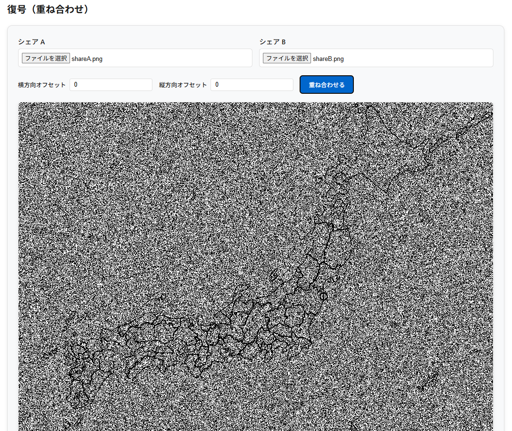
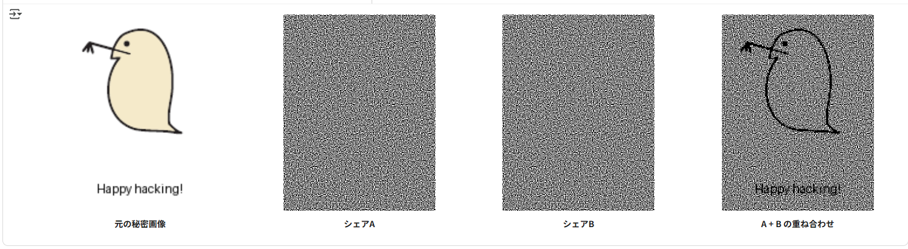

<!--
---
title: VisualCryptography CipherLab
category: cryptography
difficulty: 1
description: A hands-on web tool to learn Visual Cryptography (VSS/VSSS) through simple 2-sheet share generation and overlay decoding.
tags: [visual-cryptography, vsss, secret-sharing, education, demo]
demo: https://ipusiron.github.io/visual-cryptography-cipherlab/
---
-->

# VisualCryptography CipherLab - 視覚暗号ツール

A hands-on web tool to learn **Visual Cryptography (VSS/VSSS)** with simple 2-sheet overlays.


[](https://ipusiron.github.io/visual-cryptography-cipherlab/)


**Day070 - 生成AIで作るセキュリティツール100**

**VisualCryptography CipherLab**は、視覚暗号（Visual Cryptography）の基本を体験できるWebツールです。

画像を2枚のシェアに分離し、それぞれ単独では意味を持たないが、重ね合わせることで秘密の画像が浮かび上がります。

>視覚暗号の技術は複数シェアに対応していますが、本ツールではシンプルに2枚のシェアのみに対応しています。

---

## 🌐 デモページ

👉 **[https://ipusiron.github.io/visual-cryptography-cipherlab/](https://ipusiron.github.io/visual-cryptography-cipherlab/)**

ブラウザーで直接お試しいただけます。

---

## 📸 スクリーンショット

>  
>*2枚のシェアを重ね合わせることで原画像を目視で読み取れる*

---

## ✨ 機能

- **4つのタブ構成**
  - **基礎知識** — 視覚暗号の基本概念と特徴を学習
  - **暗号化** — 画像ファイルを2枚のランダムなシェアに分割
  - **復号** — 2枚のシェアを重ねて秘密画像を復元
  - **理論** — アコーディオン形式で発展的な理論と応用例を解説

- **直感的なUI**
  - ライトモード対応の見やすいデザイン
  - ヘルプアイコン（？）でホバー時に詳細説明を表示
  - レスポンシブ対応で様々なデバイスで利用可能

- **画像処理機能**
  - 画像ファイルのドラッグ&ドロップ対応
  - しきい値調整による白黒変換の最適化
  - 2×2ピクセル拡張による高品質なシェア生成
  - 生成されたシェアの個別ダウンロード機能

- **復号機能**
  - 2枚のシェア画像の重ね合わせ表示
  - 位置調整用のオフセット機能（横方向・縦方向）
  - Canvas APIによる高速な画像合成

- **教育コンテンツ**
  - 視覚暗号の基本原理をアニメーション付きで解説
  - VSSS（Visual Secret Sharing Scheme）の理論背景
  - 実用的な応用例（認証、偽造防止、QRコード融合など）
  - サンプル画像とPython生成スクリプトを提供

---

## 🔐 視覚暗号とは？

**視覚暗号（Visual Cryptography）**は、1994年に **Moni Naor** と **Adi Shamir** によって提案された暗号方式です。

通常の暗号は「暗号文＋鍵→復号アルゴリズム→平文」という流れを取りますが、視覚暗号では **復号に計算処理を必要とせず、人間の目そのものが復号器** となります。

- 秘密画像を複数のシェア（透明フィルムや画像ファイル）に分割。  
- 単独のシェアは完全にランダムノイズのように見え、秘密は読み取れない。  
- 規定枚数のシェアを重ね合わせると、黒と白の濃淡差によって秘密画像が浮かび上がる。  

### 図解イメージ

視覚暗号では、元画像を **2枚のシェア** に分割します。  
それぞれはランダムノイズのように見えますが、重ね合わせると秘密が浮かび上がります。

| 元画像 | シェアA | シェアB | 重ね合わせ（復号結果） |
|--------|--------|--------|-------------------------|
|  |  |  |  |

これらの画像の作成には、[generate_vss_sample.py](/examples/generate_vss_sample.py)を用いました。

- **secret.png** - 元の秘密画像
- **shareA.png** - シェアA（ランダムなドットパターン）
- **shareB.png** - シェアB（ランダムなドットパターン）
- **overlay.png** - シェアAとBを重ね合わせた結果（秘密が復元される）

### サンプル画像の生成結果を見る

Google Colabで"generate_vss_sample.py"ファイルを実行した手順は、以下のとおりです。

1. 以下の「Open in Colab」ボタンをクリック。

[](https://colab.research.google.com/github/ipusiron/visual-cryptography-cipherlab/blob/main/examples/generate_vss_sample.ipynb)

※事前準備は不要。ブラウザーだけで実行可能です。

2. Google Colabが開いたら、セルを順番に実行します。
3. 生成された4つの画像が表示されます。

>  
>*生成した4画像の比較*

---

## 🔍 単純な例：視覚暗号の基本原理

白黒の二値画像を2枚のシート（シェア）に分けて記録することを考えます。

- **黒いピクセル**  
  - シートA: ■□
  - シートB: □■

- **白いピクセル**  
  - シートA: ■□
  - シートB: ■□

### 単独のシート
- 各シートは「■」と「□」が半々の砂嵐のような無意味な像になる。  
- 一方のシートだけからは、元画像が黒なのか白なのかを判別できない。  

### 2枚を重ね合わせたとき
- **黒ピクセル**  
  - (■□ と □■) を重ねる → 「■■」となり黒く見える。  
- **白ピクセル**  
  - (■□ と ■□) を重ねる → 「■□」のまま → 灰色っぽく見える。  

### 結果
- 黒は黒、白は灰色に見えるため、コントラスト差によって秘密の画像が人間の目で判読できる。  

👉 この「黒＝濃く見える」「白＝灰色に見える」という単純な仕組みが、視覚暗号の基本原理です。

---

## 📋 視覚暗号の特徴

- **人間の目で復号**  
  PCやアルゴリズム不要。シェアを重ねるだけで秘密が復元できる。
- **単独シェアは情報を持たない**  
  完全にランダムに見えるため、安全性が高い。
- **ピクセル拡張**  
  秘密画像の1ピクセルを複数のサブピクセルに置き換えるため、シェアが大きくなる。
- **白黒画像向け**  
  基本は2値画像。グレースケールやカラー対応は拡張手法が必要。

---

## 🗺️ 使い方の例：地図画像での活用

このツールは「マークの位置を隠す／共有する」といった応用もできます。
たとえば、宝の地図から2枚のシェアに生成し、その2枚を重ね合わせると宝の位置が判明します。

ここでは `examples/map.png` （相馬市の位置にマークを付けた地図画像）を使って、視覚暗号のシェア画像を生成・復元することで、指定の位置を確認してみましょう。

### 手順

1. **暗号化タブ** で `examples/map.png` をアップロード。  
2. 生成された **shareA.png** と **shareB.png** を保存。  
   - それぞれはノイズ画像に見えるため、単独ではマークの位置は分からない。  
3. **復号タブ** に shareA / shareB を読み込み、重ね合わせる。  
4. 復元画像により、相馬市のマークの位置を特定できることを確認。

---

## 🚀 VSSS（視覚復号型秘密分散法）への発展

- **(2,2) スキーム → (k,n) スキーム**  
  2枚で復元する方式から、n枚のうちk枚以上で復元できる方式へ一般化。
- **秘密分散共有との融合**  
  暗号理論の秘密分散法と同様、複数人がシェアを持ち寄らないと復元できない。
- **拡張スキーム**  
  グレースケール・カラー対応、効率的な非拡張型スキームなどの研究が進展。

---

## 💡 VSSSの応用例

- **認証・アクセス制御**  
  2要素認証や入場確認に利用可能。シェアを重ねると認証マークが現れる。  
- **偽造防止・透かし**  
  チケット、商品ラベル、証明書に仕込み、真偽判定に活用。  
- **セキュア情報配布**  
  新聞・雑誌に片方のシェアを印刷、会員カードを重ねると秘密が見える。  
- **QRコードとの融合**  
  複数シェアを重ねると有効なQRコードが読める仕組み。BEC防止やユーザ認証に応用。  
- **教育用途**  
  「複数人で秘密を守る」仕組みを直感的に体験でき、暗号教育に適する。  

---

## 📁 ディレクトリー構成

```
visual-cryptography-cipherlab/
├── index.html              # メインのWebアプリケーション
├── style.css              # ライトモード対応のスタイル定義
├── script.js               # VSS暗号化・復号の実装
├── CLAUDE.md               # Claude Code用の開発ガイド
├── LICENSE                 # MITライセンス
├── README.md               # プロジェクト説明（このファイル）
├── .nojekyll               # GitHub Pages設定
├── assets/                 # スクリーンショット・画像素材
│   ├── screenshot.png      # アプリケーションのスクリーンショット
│   └── sample_4pictures.png # サンプル生成結果の比較画像
└── examples/               # サンプル画像・生成スクリプト
    ├── generate_vss_sample.py      # Python版VSS生成スクリプト
    ├── generate_vss_sample.ipynb   # Google Colab用ノートブック
    ├── mijinko.png                 # 元画像サンプル（ミジンコ）
    ├── map.png                     # 地図画像サンプル（相馬市）
    ├── secret.png                  # 生成された秘密画像
    ├── shareA.png                  # 生成されたシェアA
    ├── shareB.png                  # 生成されたシェアB
    └── overlay.png                 # 重ね合わせ結果画像
```

---

## 📚 発展情報

ここでは、視覚暗号 (Visual Cryptography) / VSSS に関する研究的な背景や応用の発展的情報をまとめます。

### 視覚暗号と VSSS の研究動向
- 1994 年に Naor と Shamir が提案した視覚暗号は、秘密画像を複数のシェアに分割し、人間の目で復号可能とする方式。
- **ピクセル拡張**：1 ピクセルを複数のサブピクセルに展開することで黒と白のコントラスト差を作る。
- **VSSS (Visual Secret Sharing Scheme)** へ発展し、(2,2) から (k,n) スキームに一般化。  
- 最近はグレースケール・カラー対応や、シェアのサイズ増大を抑える **非拡張型スキーム** も研究されている。  
- **EVCS (Extended Visual Cryptography Scheme)** では「意味のあるシェア」を生成する手法も提案。

### QRコードと VSSS の応用
- QRコードは白黒パターンを持つため視覚暗号との親和性が高い。
- **BEC Defender (2024)**: QRコードに基づいた視覚暗号で BEC 攻撃を防ぐ。VCS ルールを使って QR を 2 枚のシャドーシェアに分割し、背景に埋め込む手法。  
- **Adaptive VC Scheme (2023)**: QRコードの構造に適応してシェアを生成、美観を維持しつつ復号精度を高める。  
- 攻撃者視点: シェア 1 枚では完全にランダムノイズ。誤り訂正を逆用して部分復元を狙う可能性あり。  
- 防御者視点: 複数シェアが揃わなければ復号できない仕組み。エラー訂正や認証を組み合わせて堅牢化できる。

### 応用分野と事例調査
- **認証・アクセス制御**: ユーザーシェア＋サーバーシェアでログインや入場確認。  
- **偽造防止・透かし**: 商品ラベルや証明書に埋め込み、重ねて真偽確認。  
- **セキュア情報配布**: 新聞・雑誌に埋め込まれたシェアを、別シェアと重ねると秘密が浮かぶ。  
- **投票・電子民主主義**: 投票用紙をシェア分割して改ざん防止。複数の立会人が復元に関与。  
- **教育・啓発**: 学生に「秘密を分けて持つ」概念を体験させる教材。  
- **メリット**: 計算不要・直感的。  
- **制約**: シェアのサイズ増大、白黒画像が基本、カラー対応は難しい。

---

## 📄 ライセンス

MIT License – 詳細は [LICENSE](LICENSE) を参照してください。

---

## 🛠 このツールについて

本ツールは、「生成AIで作るセキュリティツール100」プロジェクトの一環として開発されました。 
このプロジェクトでは、AIの支援を活用しながら、セキュリティに関連するさまざまなツールを100日間にわたり制作・公開していく取り組みを行っています。

プロジェクトの詳細や他のツールについては、以下のページをご覧ください。  

🔗 [https://akademeia.info/?page_id=42163](https://akademeia.info/?page_id=42163)
